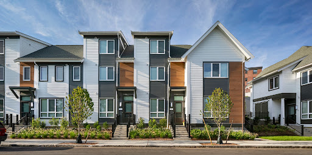

# Analyzing King County House Sales Data.

## Project overview
The aim of this project is to analyze the King County House Sales dataset, which comprises data from house sales in King County, spanning the years 2014 to 2015. This dataset provides a comprehensive view of various factors influencing house prices in the region, including location, size, condition, and other relevant attributes. By exploring and analyzing this dataset, we seek to gain insights into the factors that drive house prices in King County and to build predictive models to estimate house prices accurately.

We use an iterative process to prepare and model our data while utilizing exploratory data analysis to better understand our dataset. Next, we try to iterate across models using various statistical techniques in order to identify the model with the best statistical R-Squared Value, RMSE, and differential values.

## Stakeholder & Business understanding
The stakeholder for this project is a real estate agency specializing in residential property transactions. The business problem revolves around the need to offer strategic advice to homeowners on how specific renovations can impact their homes' market value. By understanding which home features contribute most significantly to property valuation, the agency can provide valuable guidance to clients seeking to maximize their investment returns through targeted improvements.

## Data understanding

This project utilizes the King County House Sales dataset, which is available in the kc_house_data.csv file located in the data folder of this GitHub repository. A comprehensive description of the column names can be found in the column_names.md file in the same folder. While the column names provide some information, it is important to note that further research or informed judgment may be necessary to fully understand the meaning of the data.

The analysis performed on the dataset included the following steps:
1. Data cleaning and preparation
2. Exploratory Data Analysis (EDA)
3. Pre-processing

By performing these steps, we aimed to gain a comprehensive understanding of the dataset and prepare it for further analysis and modeling

## Modelling
#### 1. Linear regression model

A simple linear regression model was built using the square footage of living space (sqft_living) as the predictor due to its strong correlation with house prices and linear relationship.

The resulting linear regression model had an R-squared value of 0.49, indicating that 49% of the variance in house prices could be explained by square footage alone. However, this model showed significant variability in predictions, as evidenced by a high Root Mean Squared Error (RMSE) of approximately 256,860.61.

#### 2. Multiple linear regression model

The subsequent multiple linear regression model incorporated a broader set of features to better capture the variance in house prices, resulting in an improved R-squared value of 0.676.

To enhance the predictive power and normality of the target variable, we performed a log transformation on house prices (price), leading to a more symmetric distribution

Using log-transformed price;

This log-transformed multiple linear regression model achieved a higher R-squared value of 0.772, explaining approximately 77.2% of the variance in log-transformed prices.

## Conclusion

The multiple linear regression analysis revealed significant relationships between various features and house prices. Factors such as the number of bedrooms, bathrooms, square footage (sqft_living), waterfront location, grade, and location coordinates (latitude and longitude) emerged as key predictors of housing prices. The model also highlighted the impact of specific features on price variation, offering insights into how different attributes contribute to property valuations.

